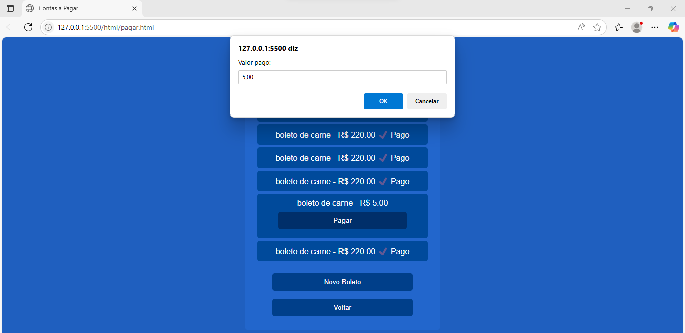

# 👨‍💼 Sistema de Controle Financeiro – Mini Mercado do Cláudio

[]()
[]()

---

## 👥 Integrantes do Grupo

- Davi Foppa
- João Pedro Santos  
- Vitor Santos

---

## Explicação do Problema

Cláudio é dono de um mini mercado na cidade de Sapucaia do Sul e controla suas finanças usando um **caderno**, anotando:

- Contas a pagar para fornecedores  
- Débitos de clientes (o famoso “caderninho”)  

Esse processo manual causa vários problemas:

- Atraso no pagamento de boletos → gera juros  
- Falta de organização nas anotações  
- Clientes que não pagam e não são cobrados  
- Perda de dinheiro por falta de controle  
- Dificuldade em gerenciar pagamentos parciais  

Para expandir o negócio, Cláudio precisa **digitalizar o controle financeiro**, com segurança, organização e cálculos automáticos.


## Explicação da Solução Desenvolvida

Criamos um **sistema completo de controle financeiro**, permitindo gerenciar:

### Contas a Receber
- Cadastro de clientes  
- Definição de juros diários personalizados, exemplo:  
  `0,5% ao dia → 15% em 30 dias`
- Registro de débitos com vencimento   
- Aceita **pagamentos parciais**  
- Exibe saldo total atualizado  

### Contas a Pagar
- Cadastro de fornecedores  
- Registro de contas a pagar  
- Controle de vencimentos  
- Prevenção de atrasos  

### Banco de Dados
- Todas as informações são salvas em banco de dados real  
- Persistência garantida, sem risco de perda  


## Ferramentas Usadas

### **Backend**
- JavaScript

### **Banco de Dados**
- FireBase

### **Frontend**
- HTML5  
- CSS3  

### **Outras Ferramentas**
- Git / GitHub  
- VS Code  
- Figma (prototipação)  


## Como Executar a Solução

###  1- Clonar o repositório
```sh
git clone https://github.com/davi5043/MercadoDjv
```


### 2- Executar o sistema
 execute no VsCode e abra no seu navegador 


### 3- Banco de dados
Ele é criado automaticamente ao executar o projeto pela primeira vez.

---

## Prints do Projeto

>  *![imagem da página de login]!(image-3.png)*
>  **
>  **
>  **
 
## Conclusão

Este projeto resolve um problema real enfrentado pelo comerciante Cláudio, trazendo:

✔ Organização  
✔ Controle financeiro  
✔ Cálculo automático de juros  
✔ Pagamentos parciais  
✔ Segurança e persistência dos dados  

